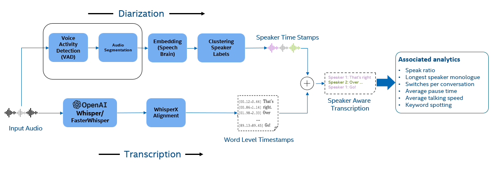

PROJECT NOT UNDER ACTIVE MANAGEMENT

This project will no longer be maintained by Intel.

Intel has ceased development and contributions including, but not limited to, maintenance, bug fixes, new releases, or updates, to this project.

Intel no longer accepts patches to this project.

If you have an ongoing need to use this project, are interested in independently developing it, or would like to maintain patches for the open source software community, please create your own fork of this project.

Contact: webadmin@linux.intel.com

# Intel® Optimized Speech-to-Text Analytics System using OpenAI Whisper
Intel optimized Speech-to-Text Analytics System performs voice-to-text transcription, diarization and speaker-aware transcription. Downstream tasks for associated analytics, such as listen-to-speak ratio, average talking speed, longest customer monologue, switches per conversation, average pause time and keyword spotting are computed using speaker-aware transcription.


## Solution Architecture


Once the input audio is fed to the system, diarization pipeline generates speaker-level time stamps (time duration per speaker utterance) and transcription pipeline generates word-level timestamps (time stamps of each word). These two outputs are combined to get speaker aware transcription. All the associated analytics are computed from generated speaker aware transcription.

**Note**: Topic Modeling and Sentiment Analysis are work in progress.

# **Table of Contents**
- [Quick Start](#quick-start)
  - [Installation](#installation)
- [Transcription Models](#transcription-models)
    - [HuggingFace](#huggingface)
    - [FasterWhisper](#fasterwhisper)
- [Model Serving and Rest APIs](#model-serving-and-rest-apis)
- [User Interface](#user-interface)
- [Performance Tuning](#performance-tuning)
- [Live Transcription](#live-transcription)
- [Supported Dtypes](#supported-dtypes)
- [References](#references)

# Quick Start 

## 1. Installation

Create a virtual environment.

```bash
conda create -n asr_pipeline python=3.10 -y
conda activate asr_pipeline
```

Install dependenices using the installation script.

```bash
./install.sh
```

## 2. Run Transcription

```bash
python main.py --config_file config/asr_transcription.yaml --input_audio <path_to_input_audio_file> --output_dir ./output/
```

## 3. Speaker Aware Transcription

During speaker aware transcription, this repo uses [pyannote/speaker-diarization-3.1](https://huggingface.co/pyannote/speaker-diarization-3.1) for diarization. Please get access to diarization model from [https://huggingface.co/pyannote/speaker-diarization-3.1](https://huggingface.co/pyannote/speaker-diarization-3.1).

Create a `.env` file and set HF_ACCESS_TOKEN environment variable. This token is needed for diarization models. It can be obtained from [HuggingFace](https://huggingface.co/docs/hub/en/security-tokens).

```
HF_ACCESS_TOKEN=<your access token>
```
Run the speaker aware transcription pipeline.

```
python main.py --config_file config/asr_speaker_aware.yaml --input_audio <path_to_input_audio_file> --output_dir ./output/logs --target_keywords rabbit,duchess,king
```

On successful execution, the following outputs are generated inside `output/logs` folder

1. raw_transcription.txt - Transcription of input audio
2. aligned_transcription.txt - Transcription time aligned with input audio
3. diarization_transcription.txt - Separate audio by speaker with attribution 
4. segment_transcription.txt - Speaker utterance with timestamps
5. analytics.txt - Computed associated analytics
6. logs.txt - Information on configurations, execution and profiling.

# Transcription Models

Transcription supports two backends - HuggingFace and FasterWhisper

## 1. HuggingFace (**Recommended**)
Please refer the links below for options on models(size) and their respective keys.
- OpenAI - [https://huggingface.co/openai](https://huggingface.co/openai)
- Distil-Whisper - [https://huggingface.co/distil-whisper](https://huggingface.co/distil-whisper)

The default HuggingFace transcription topology is `distil-whisper/distil-large-v2`. To select a different topology, update `asr_transcription.yaml` or `asr_speaker_aware.yaml` accordingly.
Usage example,
```yaml
transcription:
  topology: distil-whisper/distil-large-v2 # model name key
  compute_type: fp32
  backend: HFWhisper
  batch_size: 16 # Chunk batch size for long-form transcription
  device: cpu
```

## 2. FasterWhisper

For model name keys, please refer [https://github.com/m-bain/whisperX](https://github.com/m-bain/whisperX)

The default FasterWhisper transcription topology is `large-v2`. To select a different topology, update `asr_transcription.yaml` or `asr_speaker_aware.yaml` accordingly.
Usage example,
```yaml
transcription:
  topology: large-v2 # model name key
  compute_type: fp32
  backend: whisperx 
  batch_size: 16 # Chunk batch size for long-form transcription
  device: cpu
```

For long-form transcription `batch_size` option should be set.

## Alignment

This repo uses WhisperX for transcription alignment. Please refer [WhisperX](https://github.com/m-bain/whisperX) for more details.

# Model Serving and REST APIs 

The repo contains a `Dockerfile` for easy and quick deployment. The `rest_api` module contains necessary code for exposing REST API endpoints. APIs are built using `FastAPI` and models are served using `Ray Serve`. 

### 1. Build a docker image

```bash
sudo docker build -t intel-e2e-asr .
```

If there is an error in building an image due to proxy settings use following command,

```bash
sudo docker build -t intel-e2e-asr --build-arg HTTP_PROXY=$http_proxy --build-arg HTTPS_PROXY=$http_proxy --build-arg NO_PROXY="$no_proxy" --build-arg http_proxy=$http_proxy --build-arg https_proxy=$http_proxy --build-arg no_proxy="$no_proxy" .
```

### 2. Add Proxies to `.env` file (Required only if network is guarded by proxy)

File should look as follows,
```
HF_ACCESS_TOKEN=<your access token>
http_proxy=<proxy settings> 
https_proxy=<proxy settings>
```

### 3. serve_config.yaml

`serve_config.yaml` is configuration file for serving models. `num_cpus` and other options in the `serve_config.yaml` should be set according to the platform.

### 4. Run the docker container

```bash
sudo docker run -d --name asr_container --env-file=.env -p 8888:8000 intel-e2e-asr
```
### 5. Access the APIs

To interact with APIs using `Swagger UI` open http://localhost:8000/docs in your browser.

## Run server with bare metal setup

It is also possible to serve models with bare metal installations.
Use following command. 
```
serve run serve_config.yaml
```

# User Interface

This repo contains a `streamlit` application to interact with APIs. To run `streamlit` app,

```
python -m streamlit run ui/app.py
```
By default, the streamlit application runs on http://localhost:8501/

# Performance Tuning

**Prerequisites:** 

- Examples using the `BFloat16` data type require machines with the Intel® Advanced Vector Extensions 512 (Intel® AVX-512) BF16 and Intel® Advanced Matrix Extensions (Intel® AMX) BF16 instruction sets.

- Following performance tuning examples uses Intel® Extension for PyTorch* on Intel CPUs.


## bfloat16

To speed-up the inference with the Low-Precision Data Type `bfloat16`, specify `bf16` for `compute_type` key in the configuration file.

```yaml
transcription:
  topology: distil-whisper/distil-large-v2 
  compute_type: bf16 # uses bfloat16
  backend: HFWhisper # HFWhisper or whisperx
  batch_size: 16 # Chunk batch size for long-form transcription
  device: cpu
```

During inference Auto Mixed Precision (AMP) is used with bfloat16 data type. `bfloat16` is also supported for diarization and alignment models.

```yaml
alignment:
  compute_type: bf16
  language: en
  backend: whisperx_alignment
  device: cpu
diarization:
  pipeline_config: pyannote/speaker-diarization-3.1 
  use_auth_token: true
  compute_type: bf16
  device: cpu
  backend: pyannote_diarization
```

Similary `int8` can be specified for the `compute_type`. It performs dynamic quantization using Intel® Extension for PyTorch*. Check the support matrix for details on supported data types [Supported Dtype](#supported-dtypes)

## Run time environments

For runtime environments settings `jemalloc`, `gperftools` and `intel-openmp` are required.

`main.sh` sets run time environment variables for better performance. Usage is as follows:

```bash
 ./main.sh --config config/asr_speaker_aware.yaml --input <path_to_input_audio_file> --output_dir ./output/logs
```
Please note by default it runs the application on all available cores. To bind execution to specific cores, use `numactl` as explained below.

## numactl

Assume cores 0-3 are on socket 0, the following command binds script execution on core 0-3, and binds memory access to socket 0 local memories.

```bash
numactl --membind 0 -C 0-3 python main.py --config_file config/asr_speaker_aware.yaml --input_audio <path_to_input_audio_file> --output_dir ./output/logs
```
## OMP_NUM_THREADS

Environment variable OMP_NUM_THREADS sets the number of threads used for parallel regions. By default, it is set to be the number of available physical cores. It can be used along with numactl settings, as the following example. If cores 0-3 are on socket 0, the following example command runs on cores 0-3, with 4 OpenMP threads.

```bash
OMP_NUM_THREADS=4 numactl -C 0-3 --membind 0 python main.py --config_file config/asr_speaker_aware.yaml --input_audio <path_to_input_audio_file> --output_dir ./output/logs
```

For more information read here [https://intel.github.io/intel-extension-for-pytorch/cpu/latest/tutorials/performance_tuning/tuning_guide.html](https://intel.github.io/intel-extension-for-pytorch/cpu/latest/tutorials/performance_tuning/tuning_guide.html)

## Hardware Enivornment
| Recommended Hardware         | Precision  |
| ---------------------------- | ---------- |
| Intel® 4th Gen Xeon® Scalable Performance processors| float32, bfloat16 |

# Live Transcription

**Note:** This is work in progress.

To run live transcription, use following script. Please note, as of now only real-time simulation from recorded file is supported.

```bash
python main_stream.py --config_file config/asr_live_stream.yaml --input_audio <path_to_input_audio_file> --output_dir ./logs/
```

This repo uses [Whisper Streaming](https://github.com/ufal/whisper_streaming) implementation for the live transcription. 

# Supported Dtypes

| Model    | FP32 | BF16 | INT8 (Dynamic Quantization) |
| -------- | ------- |-------|-------|
| HuggingFace Whisper (openai)  | ✅    |✅|✅|
| HuggingFace Whisper (distil) | ✅     |✅|✅|
| whisperx  (Faster-Whisper)   | ✅    |❌|✅|
| whisperx alignment    | ✅    |✅|❌|
| pyannote diarization   | ✅    |✅|❌|

# References

1. Whisper_streaming [https://github.com/ufal/whisper_streaming](https://github.com/ufal/whisper_streaming)
2. Whisperx [https://github.com/m-bain/whisperX](https://github.com/m-bain/whisperX)
3. FasterWhisper [https://github.com/SYSTRAN/faster-whisper](https://github.com/SYSTRAN/faster-whisper)
4. pyannote-audio [https://github.com/pyannote/pyannote-audio](https://github.com/pyannote/pyannote-audio)
5. Whisper [https://github.com/openai/whisper](https://github.com/openai/whisper)
6. Distil-Whisper [https://github.com/huggingface/distil-whisper](https://github.com/huggingface/distil-whisper)
7. Intel® Extension for PyTorch* [https://github.com/intel/intel-extension-for-pytorch](https://github.com/intel/intel-extension-for-pytorch)
